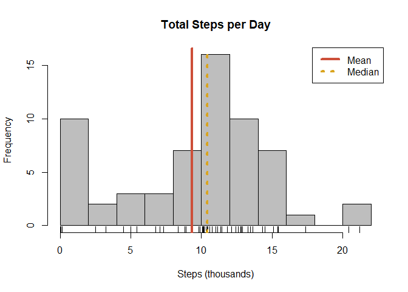
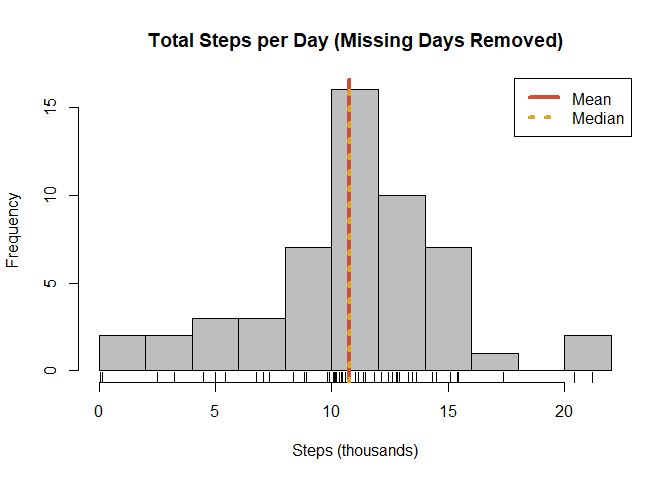
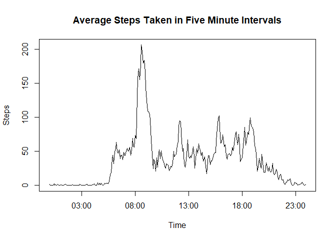
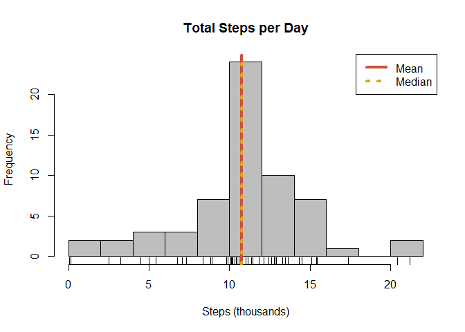
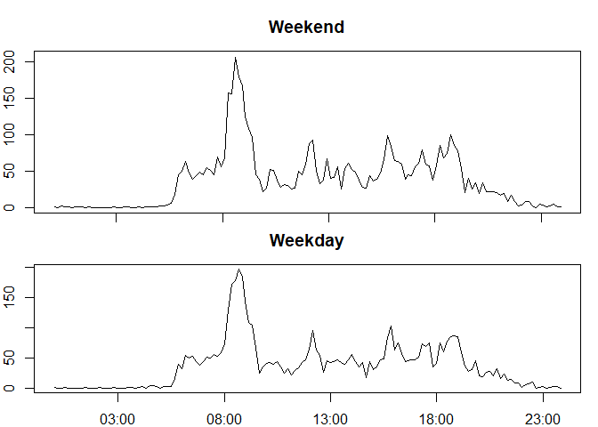

## Loading and preprocessing the data

The data for this project come from an anonymous individual's fitness device. The data were taken over October and November for a total of 61 days of records. Each day is divided into 288 five-minute intervals, and the number of steps taken by during these intervals is recorded.

Our first step is to read the data from the *activity.csv* file. We will then take a look at the data using *str()* and *head()*.


```r
stp_data <- read.csv("rawdata/activity.csv",header = T)
str(stp_data)
```

```
## 'data.frame':	17568 obs. of  3 variables:
##  $ steps   : int  NA NA NA NA NA NA NA NA NA NA ...
##  $ date    : Factor w/ 61 levels "2012-10-01","2012-10-02",..: 1 1 1 1 1 1 1 1 1 1 ...
##  $ interval: int  0 5 10 15 20 25 30 35 40 45 ...
```

```r
head(stp_data, 13)
```

```
##    steps       date interval
## 1     NA 2012-10-01        0
## 2     NA 2012-10-01        5
## 3     NA 2012-10-01       10
## 4     NA 2012-10-01       15
## 5     NA 2012-10-01       20
## 6     NA 2012-10-01       25
## 7     NA 2012-10-01       30
## 8     NA 2012-10-01       35
## 9     NA 2012-10-01       40
## 10    NA 2012-10-01       45
## 11    NA 2012-10-01       50
## 12    NA 2012-10-01       55
## 13    NA 2012-10-01      100
```

Immediately, we notice that the **date** and **interval** variables are factor and integer classes, respectively. We can combine these into a POSIX class variable by first "padding" the **interval** values with leading zeros. This will require the *stringr* package.


```r
library(stringr)
stp_data$date.time <- with(stp_data,
                           as.POSIXct(paste(date,
                                            str_pad(as.character(interval),
                                                    width = 4,
                                                    side = "left",
                                                    pad = "0")),
                                      format = "%Y-%m-%d %H%M"))
str(stp_data)
```

```
## 'data.frame':	17568 obs. of  4 variables:
##  $ steps    : int  NA NA NA NA NA NA NA NA NA NA ...
##  $ date     : Factor w/ 61 levels "2012-10-01","2012-10-02",..: 1 1 1 1 1 1 1 1 1 1 ...
##  $ interval : int  0 5 10 15 20 25 30 35 40 45 ...
##  $ date.time: POSIXct, format: "2012-10-01 00:00:00" "2012-10-01 00:05:00" ...
```

Now, we have a data frame with four variables. The original **date** and **interval** variables will be handy in the next two sections when we want to group the data by date and then by time of day. Later, when comparing weekdays to weekends, the POSIX **date.time** variable will be useful. We also see that some data is missing from the **steps** variable, which we will address later.

## What is mean total number of steps taken per day?

We will use the package, *dplyr*, to group and summarise the data. By grouping by **date** and taking the sum of **steps**, we obtain a table that contains the total steps taken for each day. Using this table, we will plot a histogram with vertical lines indicating the mean and median values.


```r
library(dplyr)

## Group and summarise data
stp_daily <- select(stp_data,date,steps)%>%
  group_by(date)%>%
  summarise(stp_total = sum(steps,na.rm = T)/1000,
            int_mean = mean(steps,na.rm = T))

## Find mean and median of total steps per day
stp_mean <- mean(stp_daily$stp_total)
stp_median <- median(stp_daily$stp_total)

## Plot histogram with mean and median lines
hist(stp_daily$stp_total,
     breaks = 10,
     xlab = "Steps (thousands)",
     main = "Total Steps per Day",
     col = "gray")
rug(stp_daily$stp_total)
abline(v = stp_mean,
       col = "tomato3",
       lty = 1,
       lwd = 4)
abline(v = stp_median,
       col = "goldenrod",
       lty = 3,
       lwd = 4)
legend("topright",
       legend = c("Mean","Median"),
       col = c("tomato3","goldenrod"),
       lwd = 4,
       lty = c(1,3))
```

<!-- -->

From this initial analysis, we find that the mean total steps per day is 9,354 steps and the median is 10,395 steps.

However, looking at our histogram, we notice a large spike in our first bin. This is likely because for each day that no data were recorded, the total steps given by the function *summarise()* is zero. It seems unlikely that our subject stayed in bed all day on days that they did not use their fitness device. 

To solve this, we will eliminate days in which every value of **steps** was NA. Our round-about method will be to use the mean values that we calculated in the last chunk of code. Any date that contained only NA values could not be averaged, because it would require a division by zero. So, the **int_mean** value for days of completely missing data will be NAN. We will remove any such days using *dplyr::filter()* and replot using the same parameters as before.


```r
## Remove days of complete na records
stp_daily2 <- dplyr::filter(stp_daily,
                            !is.nan(int_mean))

## Find mean and median of total steps per day
stp2_mean <- mean(stp_daily2$stp_total)
stp2_median <- median(stp_daily2$stp_total)

## Plot histogram with mean and meidan lines
hist(stp_daily2$stp_total,
     breaks = 10,
     xlab = "Steps (thousands)",
     main = "Total Steps per Day (Missing Days Removed)",
     col = "gray")
rug(stp_daily2$stp_total)
abline(v = stp2_mean,
       col = "tomato3",
       lty = 1,
       lwd = 4)
abline(v = stp2_median,
       col = "goldenrod",
       lwd = 4,
       lty = 3)
legend("topright",
       legend = c("Mean","Median"),
       col = c("tomato3","goldenrod"),
       lwd = 4,
       lty = c(1,3))
```

<!-- -->

Our histogram now looks much closer to being normally distributed, and, in fact, our mean and median are very close. The mean total steps taken each day is 10,766 steps and the median is 10,765 steps.

## What is the average daily activity pattern?

To give us an idea of a pattern of daily activity, we will find the average number of steps in each five minute time interval throughout the day. We will start as we did in the last section by grouping and summarising the data with *dplyr* functions. We will repeat the process of converting the **interval** values into POSIX class, but this time we will not provide date information. The default date will be the current date, but it will not be visible when plotting.


```r
library(stringr)

## Group and summarise data
act_ptrn <- select(stp_data, interval, steps)%>%
  group_by(interval)%>%
  summarise(stp_mean = mean(steps,na.rm = T))

## Create time variable from interval identifier
time_chr <- str_pad(as.character(act_ptrn$interval),
                    width = 4,
                    side = "left",
                    pad="0")
act_ptrn$time <- as.POSIXct(time_chr,format="%H%M")

## Find interval time with peak activity
peak <- max(act_ptrn$stp_mean)
peak_time <- act_ptrn$time[act_ptrn$stp_mean == peak]
peak_time_formatted <- format(peak_time, format = "%H:%M %p")

## Plot average steps in five minute intervals
plot(act_ptrn$time,
     act_ptrn$stp_mean,
     type = "l",
     xlab = "Time",
     ylab = "Steps",
     main = "Average Steps Taken in Five Minute Intervals")
```

<!-- -->

The time series plot we obtain appears to match a typical diurnal schedule with minimal activity between 11:00pm and 5:00am. The peak activity occurs at 08:35 AM. Perhaps, this indicates a daily morning exercise.

## Imputing missing values

We will first take a look at how many observations in our data frame are missing values. We will use the function *complete.cases()*.


```r
missing_observations <- sum(!complete.cases(stp_data))
summary(stp_data$steps)
```

```
##    Min. 1st Qu.  Median    Mean 3rd Qu.    Max.    NA's 
##    0.00    0.00    0.00   37.38   12.00  806.00    2304
```

From the summary we see that there are 2,304 observations with missing values. This number offers a clue about an underlying pattern in the missing values. There are 288 five minute intervals in a 24 hour day. Our number of missing values is a multiple of 288, so we might guess that every missing value belongs to a full day of missing values. By comparing the two histograms in the first section, we can already tell that there are around 7 or 8 completely missing days from the data. 

We can quickly test this, by grouping the data by date and creating a variable **missing_days** that will count the number of missing observations in each day.


```r
## Group the data by date and add up missing observations for each day
comp_days <- select(stp_data, date, steps)%>%
  group_by(date)%>%
  summarise(missing_days = sum(!complete.cases(steps)))

table(comp_days$missing_days)
```

```
## 
##   0 288 
##  53   8
```

From the above table, we see that we have 8 days of completely missing data and 53 days of complete data with no missing values. This knowledge eliminates some possible strategies for imputing the missing data, such as averaging adjacent values from the same day. Instead, we will use our typical daily activity pattern that we found in the last section and apply that pattern to the missing days.


```r
## Loop over all rows of data frame
for (i in 1:dim(stp_data)[1]) {
  ## If step data is missing...
  if (is.na(stp_data$steps[i])) {
    ## Find the interval identifier
    int_i <- stp_data$interval[i]
    ## Set step value to mean step value for the particular interval
    stp_data$steps[i] <- act_ptrn$stp_mean[act_ptrn$interval == int_i]
  }
}

summary(stp_data$steps)
```

```
##    Min. 1st Qu.  Median    Mean 3rd Qu.    Max. 
##    0.00    0.00    0.00   37.38   27.00  806.00
```

From the summary, we can see that there are no longer missing values. Now, we will look at the histogram of daily steps as we did in the first section.


```r
## Group ands ummarise data
stp3_daily <- select(stp_data,date,steps)%>%
  group_by(date)%>%
  summarise(stp_total = sum(steps)/1000)

## Find mean and median of total stpes per day
stp3_mean <- mean(stp3_daily$stp_total)
stp3_median <- median(stp3_daily$stp_total)

## Plot histogram with mean and median lines
hist(stp3_daily$stp_total,
     breaks = 10,
     xlab = "Steps (thousands)",
     main = "Total Steps per Day",
     col = "gray")
rug(stp3_daily$stp_total)
abline(v = stp3_mean,
       col = "tomato3",
       lty = 1,
       lwd = 4)
abline(v = stp3_median,
       col = "goldenrod",
       lty = 3,
       lwd = 4)
legend("topright",
       legend = c("Mean","Median"),
       col = c("tomato3","goldenrod"),
       lwd = 4,
       lty = c(1,3))
```

<!-- -->

The mean of our new, imputed data is 10,766 steps and the median is 10,766 steps. Which is nearly the same result we achieved by simply removing the missing days. This makes sense, since we replaced all the zero values from our first histogram with the mean value of our second histogram. 

## Are there differences in activity patterns between weekdays and weekends?

Lastly, we will use our imputed data to compare average activity patterns between weekdays and weekends. We will begin by using the function *weekdays()* to extract a day of the week value from our **date.time** POSIX variable. Then we will convert this to a factor, using a logical vector as an intermediate step, and save it as a new variable in the data frame.

With this new weekday vs weekend factor, we will group the data by time interval and weekday vs weekend. Then we will plot the activity patterns for each.


```r
## Find day of week for each date
day_of_week <- weekdays(stp_data$date.time)
## Create a logical vector to find weekend days
wkend <- day_of_week == "Saturday" | day_of_week == "Sunday"
## Convert logical vector to factor vector
stp_data$week <- factor(as.numeric(wkend),
                        labels = c("Weekday","Weekend"))

## Create a table, grouped by interval and week, compare weekends and weekdays
act_comp <- select(stp_data, interval, steps, week)%>%
  group_by(interval, week)%>%
  summarise(stp_mean = mean(steps))

## Create time variable from interval identifier
time_chr <- str_pad(as.character(act_comp$interval),
                    width = 4,
                    side = "left",
                    pad="0")
act_comp$time <- as.POSIXct(time_chr,format="%H%M")

## Prepare layout for plotting
par(mfrow = c(2,1), mar = c(0,2,3,1))
## Plot weekend activity pattern
plot(act_ptrn$time[act_comp$week == "Weekend"],
     act_ptrn$stp_mean[act_comp$week == "Weekend"],
     type = "l",
     xlab = "",
     xaxt = "n",
     ylab = "Steps",
     main = "Weekend")
## Specify axis without labels
## Place tick marks at same locations as weekday plot
axis(side = 1,
     at = as.POSIXct(c("0300",
                       "0800",
                       "1300",
                       "1800",
                       "2300"),
                     format = "%H%M"),
     labels = FALSE)

## Plot weekday activity pattern
par(mar = c(2,2,3,1))
plot(act_ptrn$time[act_comp$week == "Weekday"],
     act_ptrn$stp_mean[act_comp$week == "Weekday"],
     type = "l",
     xlab = "Time",
     ylab = "Steps",
     main = "Weekday")
```

<!-- -->

Looking at the two activity patterns, they look remarkably similar. The weekend pattern has a slighly higher peak. Nevertheless, it appears the subject has very similar weekend and weekday routines.
